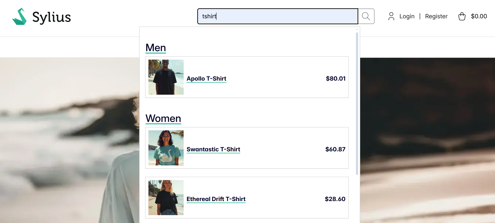
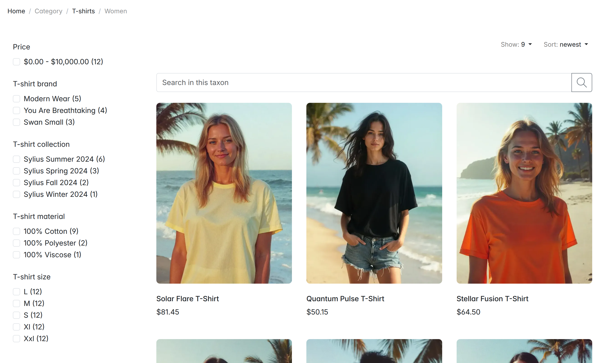

# [](https://bitbag.io/contact-us/?utm_source=github&utm_medium=referral&utm_campaign=plugins_elasticsearch)

# BitBag SyliusElasticsearchPlugin

----

[ ](https://packagist.org/packages/bitbag/elasticsearch-plugin "License") [  ](https://packagist.org/packages/bitbag/elasticsearch-plugin "Version") [  ](https://github.com/BitBagCommerce/SyliusElasticsearchPlugin/actions "Build status") [  ](https://scrutinizer-ci.com/g/BitBagCommerce/SyliusElasticsearchPlugin/ "Scrutinizer") [](https://packagist.org/packages/bitbag/elasticsearch-plugin "Total Downloads") [](http://sylius-devs.slack.com) [](https://bitbag.io/contact-us/?utm_source=github&utm_medium=referral&utm_campaign=plugins_elasticsearch)

<p>
 
</p> 

We want to impact many unique eCommerce projects and build our brand recognition worldwide, so we are heavily involved in creating open-source solutions, especially for Sylius. We have already created over **35 extensions, which have been downloaded almost 2 million times.**

You can find more information about our eCommerce services and technologies on our website: https://bitbag.io/. We have also created a unique service dedicated to creating plugins: https://bitbag.io/services/sylius-plugin-development. 

Do you like our work? Would you like to join us? Check out the **“Career” tab:** https://bitbag.io/pl/kariera. 

# About Us 
---

BitBag is a software house that implements tailor-made eCommerce platforms with the entire infrastructure—from creating eCommerce platforms to implementing PIM and CMS systems to developing custom eCommerce applications, specialist B2B solutions, and migrations from other platforms.

We actively participate in Sylius's development. We have already completed **over 150 projects**, cooperating with clients worldwide, including smaller enterprises and large international companies. We have completed projects for such important brands as **Mytheresa, Foodspring, Planeta Huerto (Carrefour Group), Albeco, Mollie, and ArtNight.**

We have a 70-person team of experts: business analysts and consultants, eCommerce developers, project managers, and QA testers.

**Our services:**
* B2B and B2C eCommerce platform implementations
* Multi-vendor marketplace platform implementations
* eCommerce migrations
* Sylius plugin development
* Sylius consulting
* Project maintenance and long-term support
* PIM and CMS implementations

**Some numbers from BitBag regarding Sylius:**
* 70 experts on board 
* +150 projects delivered on top of Sylius,
* 30 countries of BitBag’s customers,
* 7 years in the Sylius ecosystem.
* +35 plugins created for Sylius

---
[](https://bitbag.io/contact-us/?utm_source=github&utm_medium=referral&utm_campaign=plugins_elasticsearch)

---

## Table of Content

***

* [Overview](#overview)
* [Installation](#installation)
   * [Usage](#usage)
   * [Customization](#customization)
   * [Testing](#testing)
* [Functionalities](#functionalities)
* [Demo](#demo)
* [License](#license)
* [Contact and Support](#contact-and-support)
* [Community](#community)

# Overview

----
Working [Sylius](https://sylius.com/) [Elasticsearch](https://www.elastic.co/products/elasticsearch) integration based on [FOSElasticaBundle](https://github.com/FriendsOfSymfony/FOSElasticaBundle). The main goal of this plugin is to support filtering products by options, attributes, taxons, channels and name in the front product list page. It totally replaces the default Sylius `sylius_shop_product_index` route.

What is more, the plugin has a nice Sylius-oriented architecture that allows mapping resources to the Elastic document easier. It is flexible as well, so that you can customize the existing features for your specific business needs.


If you are curious about the details of this plugin, read [this blog post](https://bitbag.io/blog/elasticsearch-for-sylius) and watch the video below.

[](https://www.youtube.com/watch?v=DUswiGQePLE)


# Installation
---
For the full installation guide, please go **[here](doc/installation.md).**

## Requirements
----

This plugin requires elasticsearch server running. You can install it by following the instructions on the [official website](https://www.elastic.co/guide/en/elasticsearch/reference/current/install-elasticsearch.html).
In plugin repository there is Docker Compose file that can be used to run Elasticsearch server.

**Note:** This Plugin supports ElasticSearch 7.0 and above. If you're looking for ElasticSearch Plugin for older versions check SyliusElasticSearchPlugin in version 1.x.

We work on stable, supported and up-to-date versions of packages. We recommend you to do the same.

| Package       | Version         |
|---------------|-----------------|
| PHP           | ^8.2 || ^8.3    |
| sylius/sylius | ^2.0            |
| MySQL         | \>= 5.7         |
| NodeJS        | \>= 18.x        |
| ElasticSearch | \>= 7.x         |


## Usage

### Scope of the search

This plugin offers a site-wide search feature and taxon search feature. It is easily extendable to add more search scopes. For example in Marketplace suite you can create Vendor specific search scope.

### Searching site-wide products

There is searchbar in the header of the shop. 

<div align="center">
    
</div>

You can easily modify it by overriding the `@BitBagSyliusElasticsearchPlugin/Shop/Menu/_searchForm.html.twig` template or disable it by setting:
```yml
sylius_ui:
  events:
    sylius.shop.layout.header.content:
      blocks:
        bitbag_es_search_form:
          enabled: false
```

### Searching taxon products

When you go now to the `/{_locale}/products-list/{taxon-slug}` page, you should see a totally new set of filters. You should see something like this:

<div align="center">
    
</div>

You might also want to refer the horizontal menu to a new product list page. Follow below instructions to do so:

1. If you haven't done it yet, create two files:
   * `_horizontalMenu.html.twig` in `templates/bundles/SyliusShopBundle/Taxon` directory
   * `_breadcrumb.html.twig` in `templates/bundles/SyliusShopBundle/Product/Show` directory
2. Paste into those files content of respectively `vendor/sylius/sylius/src/Sylius/Bundle/ShopBundle/Resources/views/Taxon/_horizontalMenu.html.twig` and `vendor/sylius/sylius/src/Sylius/Bundle/ShopBundle/Resources/views/Product/Show/_breadcrumb.html.twig` files, replacing `sylius_shop_product_index` with `bitbag_sylius_elasticsearch_plugin_shop_list_products` in both of them.
3. Clean your cache with `bin/console cache:clear` command.
4. :tada:

If you're using vertical menu - follow steps above with `_verticalMenu.html.twig` file instead. It's in the same directory as the `_horizontalMenu.html.twig` file.

**Be aware! Elasticsearch does not handle dashes well. This plugin depends on the code field in Sylius resources. Please use underscores instead of dashes in your code fields.**

### Excluding options and attributes in the filter menu

You might not want to show some specific options or attributes in the menu. You can set specific parameters for that:
```yml
parameters:
    bitbag_es_excluded_facet_attributes: ['jeans_material']
    bitbag_es_excluded_facet_options: ['t_shirt_size']
```

By default, all options and attributes filters are shown.

It is also possible to disable options and attribute filters autodiscovery by setting the following parameters:
```yml
parameters:
    bitbag_es_facets_auto_discover: false
```

Then you have to manually register your filters:

Available filters:
* [`TaxonFacet`](https://github.com/BitBagCommerce/SyliusElasticsearchPlugin/blob/master/src/Facet/TaxonFacet.php) which allows to filter your search results by taxons using the ElasticSearch [`Terms`](https://www.elastic.co/guide/en/elasticsearch/reference/current/search-aggregations-bucket-terms-aggregation.html) aggregation.
* [`AttributeFacet`](https://github.com/BitBagCommerce/SyliusElasticsearchPlugin/blob/master/src/Facet/AttributeFacet.php) which allows to filter your search results by product attributes values using the ElasticSearch [`Terms`](https://www.elastic.co/guide/en/elasticsearch/reference/current/search-aggregations-bucket-terms-aggregation.html) aggregation.
* [`OptionFacet`](https://github.com/BitBagCommerce/SyliusElasticsearchPlugin/blob/master/src/Facet/OptionFacet.php) which is the same as `AttributeFacet` but for product options.
* [`PriceFacet`](https://github.com/BitBagCommerce/SyliusElasticsearchPlugin/blob/master/src/Facet/PriceFacet.php) which allows to filter search results by price range the ElasticSearch [`Histogram`](https://www.elastic.co/guide/en/elasticsearch/reference/current/search-aggregations-bucket-histogram-aggregation.html) aggregation.

Example of manual registration of filters:
```yml
services:
    bitbag_sylius_elasticsearch_plugin.facet.attribute.t_shirt_brand:
      class: BitBag\SyliusElasticsearchPlugin\Facet\AttributeFacet
      arguments:
        - '@bitbag_sylius_elasticsearch_plugin.property_name_resolver.attribute'
        - '@=service("sylius.repository.product_attribute").findOneBy({"code": "t_shirt_brand"})'
        - '@sylius.context.locale'

    bitbag_sylius_elasticsearch_plugin.facet.registry:
      class: BitBag\SyliusElasticsearchPlugin\Facet\Registry
      calls:
        -   method: addFacet
            arguments:
              - t_shirt_brand
              - '@bitbag_sylius_elasticsearch_plugin.facet.attribute.t_shirt_brand'
        - method: addFacet
          arguments:
            - price
            - '@bitbag_sylius_elasticsearch_plugin.facet.price'
        - method: addFacet
          arguments:
            - taxon
            - '@bitbag_sylius_elasticsearch_plugin.facet.taxon'
```

### Reindexing

By default, current indexes listen on all Doctrine events. You can override this setting for each index by overriding index definition in your `config.yml` file:
```yml
fos_elastica:
    indexes:
        bitbag_attribute_taxons:
            types:
                default:
                    persistence:
                        listener:
                            insert: true
                            update: false
                            delete: true
```

Indexes with `bitbag_shop_product`, `bitbag_attribute_taxons` and `bitbag_option_taxons` keys are available so far.


## Customization

### Available services you can [decorate](https://symfony.com/doc/current/service_container/service_decoration.html) and forms you can [extend](http://symfony.com/doc/current/form/create_form_type_extension.html)
```bash
$ bin/console debug:container | grep bitbag_sylius_elasticsearch_plugin
```

### Parameters you can override in your parameters.yml(.dist) file
```bash
$ bin/console debug:container --parameters | grep bitbag
```


## Testing
```bash
$ composer install
$ cd tests/Application
$ APP_ENV=test bin/console doctrine:database:create
$ APP_ENV=test bin/console doctrine:schema:create
// run elasticsearch
$ APP_ENV=test bin/console sylius:fixtures:load
$ APP_ENV=test bin/console fos:elastica:populate
$ APP_ENV=test symfony server:run 127.0.0.1:8080 -d
$ APP_ENV=test bin/console assets:install
$ open http://localhost:8080
$ vendor/bin/behat
$ vendor/bin/phpspec run
```

# Functionalities 
---
All main functionalities of the plugin are described **[here.](https://github.com/BitBagCommerce/SyliusElasticsearchPlugin/blob/master/doc/functionalities.md)**

---

If you need some help with Sylius development, don't be hesitated to contact us directly. You can fill the form on [this site](https://bitbag.io/contact-us/?utm_source=github&utm_medium=referral&utm_campaign=plugins_elasticsearch) or send us an e-mail at hello@bitbag.io!

---

[](https://bitbag.io/contact-us/?utm_source=github&utm_medium=referral&utm_campaign=plugins_elasticsearch)


# Demo
---
We created a demo app with some useful use-cases of plugins! Visit http://demo.sylius.com/ to take a look at it.

**If you need an overview of Sylius' capabilities, schedule a consultation with our expert.**

[](https://bitbag.io/contact-us/?utm_source=github&utm_medium=referral&utm_campaign=plugins_elasticsearch)

# Additional resources for developers

---
To learn more about our contribution workflow and more, we encourage you to use the following resources:
* [Sylius Documentation](https://docs.sylius.com/en/latest/)
* [Sylius Contribution Guide](https://docs.sylius.com/en/latest/contributing/)
* [Sylius Online Course](https://sylius.com/online-course/)
* [Sylius Elasticsearch Plugin Blog](https://bitbag.io/blog/elasticsearch-for-sylius)


# License

---
This plugin's source code is completely free and released under the terms of the MIT license.

[//]: # (These are reference links used in the body of this note and get stripped out when the markdown processor does its job. There is no need to format nicely because it shouldn't be seen.)

# Contact and Support 

---
This open-source plugin was developed to help the Sylius community. If you have any additional questions, would like help with installing or configuring the plugin, or need any assistance with your Sylius project - let us know! **Contact us** or send us an **e-mail to hello@bitbag.io** with your question(s).

[](https://bitbag.io/contact-us/?utm_source=github&utm_medium=referral&utm_campaign=plugins_elasticsearch)

# Community

---- 
For online communication, we invite you to chat with us & other users on **[Sylius Slack](https://sylius-devs.slack.com/).**

[](https://bitbag.io/contact-us/?utm_source=github&utm_medium=referral&utm_campaign=plugins_elasticsearch)
