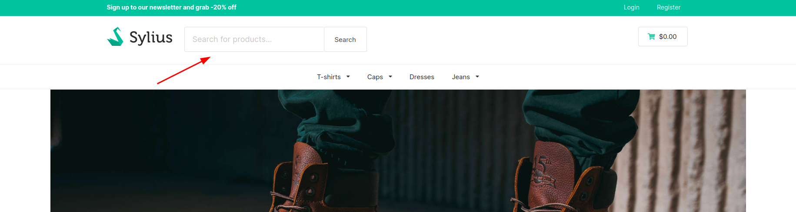
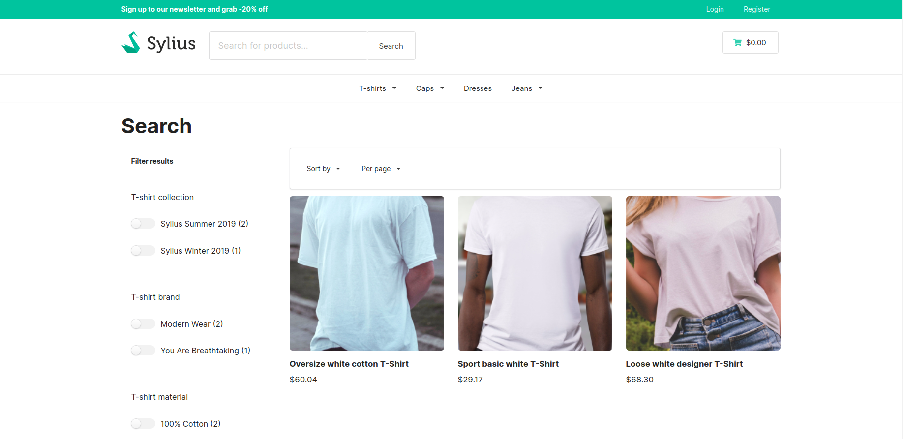
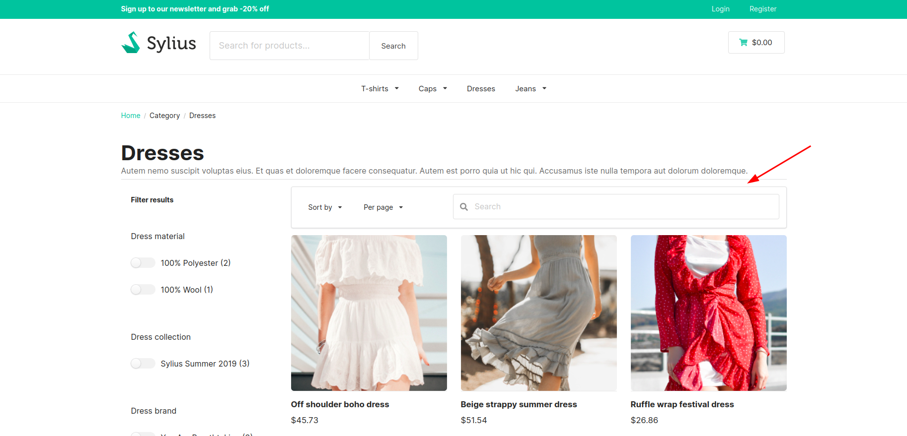
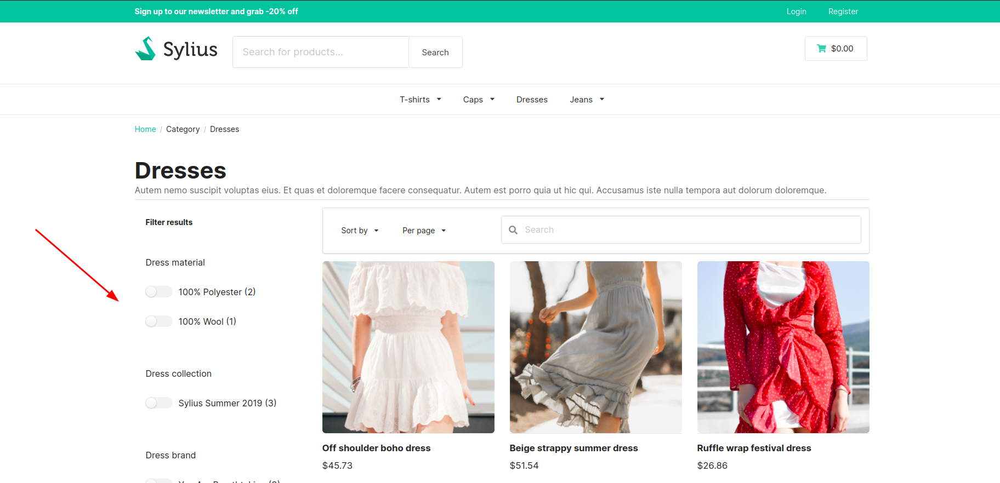

# Functionalities

---
**Main searchbar, suggestions, search results and filters**

One of the main functionalities that is provided with the plugin is the searchbar that is visible in every view in the shop. 

    

Once the product is created and enabled, for the channel that the user is using, it is possible to search for the product in the store by its name. Already during writing the name in the searchbar, the suggestions are shown for the user. By default, only 10 suggestions are shown.
By using "Search" button user will get however all possible results for the chosen phrase. 

When it happens, the user is taken to the page with the results, where they can sort them, choose how many results should be shown per one page or use filters to filter those products.

    

What is important is that all the filters that are shown there are filters that are based solely on the attributes and options of the search results. It means that there are no irrelevant filters that would apply to products from outside the search results. Additionally, each of the filters has a value next to it indicating how many search results match this filter.

Also, the user doesn't have to click "filter" button after choosing any of the filters to get the results. Once the filter is chosen, page is automatically reloaded with results for the said filter.

**Browsing taxon products**

Another important functionality is how you can search for a product within a specific taxon. By going to the `/{_locale}/products-list/{taxon-slug}` page, user will see all the products from the taxon. Once there, user can search for product that is belongs to this taxon. They can do it by using a special searchbar.

    

Apart from that, user can filter the results by using filters that are placed on the left side of the page. It works the same as on the  main searchbar search results page, but here user can also filter the results by the minimum and maximum price.

    

